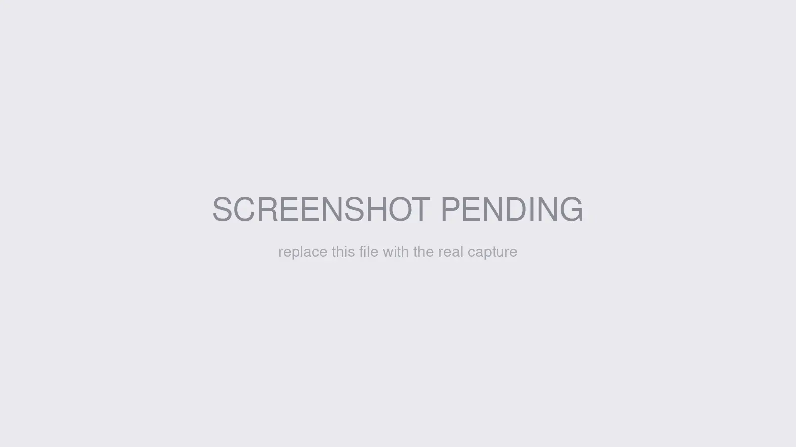

# Testing tools

Use **Search Manager → Settings → Test** when you need to prove a backend, index, query, promotion, or API example before you wire it into a template or client. The page runs the same configured Search Manager services from inside Craft, so it is the fastest operational check after creating an index, changing query rules, or troubleshooting a surprising result.

## What you'll use it for

- Confirming an index returns the expected hits before publishing a search UI
- Checking autocomplete, promotions, query rules, highlighting, snippets, and result URLs in one place
- Comparing indexed hit metadata against live element data with **Live Comparison** and **Debug Metadata**
- Verifying a backend connection and seeing whether it supports **Browse** and **Multi-Query**
- Downloading the bundled Postman collection and environment for API testing outside Craft

## Test search output

Open **Search Manager → Settings → Test**, then use the **Search** tab.

1. Choose a **Search Index**. The selector only includes enabled indices and appends the relevant site label, such as **All Sites** or a site name.
2. Enter a **Search Query**. The field accepts Search Manager operators and offers the same examples as the page placeholder: `Try: 'exact phrase', test NOT spam, title:blog, test*`.
3. Turn on any **Test Features** you need: **Auto Wildcards**, **Test Autocomplete**, **Test Promotions**, **Test Query Rules**, **Show Highlighting**, **Live Comparison**, **Hide Without URL**, or **Debug Metadata**.
4. Adjust **Snippet Options** when snippet behavior matters: **Snippet Mode**, **Snippet Length (50–1000 chars)**, **Show Code Snippets**, and **Parse Markdown**.
5. Click **Search**.

The result pane shows the query, total found, cache state, backend, execution time, rewritten query when wildcards are applied, redirects from matching query rules, result metadata, snippets, headings, matched terms, scores, and optional debug sections such as **Indexed Document**, **Element Kind**, **Commerce**, and **Custom Fields**.

Use **Quick Operator Tests** for repeatable checks. The built-in buttons cover **Basic**, **Phrase**, **NOT**, **Field**, **Wildcard**, **Boost**, **OR**, and **Combined** query examples.

### Autocomplete, promotions, and query rules

When the matching feature toggles are on, the page expands additional sections:

- **Autocomplete Suggestions** appears after enough characters are typed, using the configured autocomplete minimum length.
- **Matched Promotions** lists promotions whose query pattern matches the current query, with element and site-live status details.
- **Matched Query Rules** lists matching rules, their action effect, target metadata where available, synonyms, and redirect targets. Query-rule testing bypasses the search cache so debug output reflects a live search.

### Cache buttons

When search caching is enabled, **Clear Search Cache** clears cached search results for the selected index. When autocomplete caching is enabled, **Clear Autocomplete Cache** clears autocomplete suggestions. Both caches regenerate on the next request.

## Check backend diagnostics

Switch to the **Backend** tab to run **Backend Diagnostics**.

1. Choose a **Backend**. Enabled backends are listed by name and type, and the default backend is marked **Default**.
2. The page immediately tests the connection through `search-manager/backends/test`.
3. When the connection succeeds, the page loads backend info through `search-manager/backends/info`.

The diagnostics panel shows **Connection**, **Response Time**, **Browse**, **Multi-Query**, and **Indices**. Open **View indices in backend** to list backend-side indices and entry counts when the backend reports them.

## Download the Postman collection

The **Search** tab includes a **Developer Resources** box with **Download Postman collection**. The download is `search-manager-postman.zip` and includes:

- `Search-Manager.postman_collection.json`
- `Search-Manager.postman_environment.json`
- `README.md`

Use it when you want to test the public Search Manager API outside Craft with the same endpoint examples your frontend or integration will call.

## Next steps

- [Quickstart](../get-started/quickstart.md) — create the backend and index you will test.
- [API endpoints](../template-guides/api-endpoints.md) — compare the CP result with public REST requests.
- [GraphQL](../developers/graphql.md) — compare the CP result with GraphQL search and autocomplete.
- [Troubleshooting](troubleshooting.md) — use the test page to isolate no-result, cache, and API-key issues.
